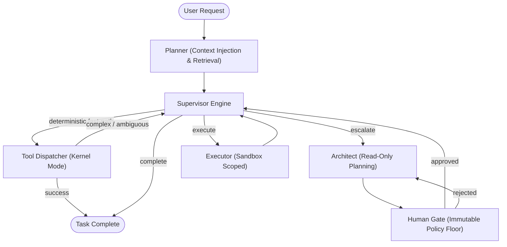

# Agent OS

[](https://github.com/simon-aibc/agent-os-langgraph/actions/workflows/ci.yml)
[](LICENSE)

[](https://github.com/simon-aibc/agent-os-langgraph/releases/tag/v2.4.0)
[](agent_os/api)

> **Agent OS: Everything is a Plugin.**<br>
> An open-source, local-first Operating System and extensible harness for autonomous AI agents.

Agent OS is an auditable, self-hostable agent operating system providing deterministic fast-path execution, read-only architect planning, human approval governance, immutable policy floors, memory retrieval lifecycles, anti-SSRF signed event egress, and a modular plugin runtime. Under the hood, stateful graph execution and checkpointing are powered by LangGraph.

**Current release:** [v2.4.0](https://github.com/simon-aibc/agent-os-langgraph/releases/tag/v2.4.0) |
[Changelog](CHANGELOG.md) |
[Architecture](docs/architecture.md) |
[Extending Agent OS](docs/EXTENDING.md) |
[Self-Hosting](docs/self-hosting.md) |
[Product Spec](docs/PRD.md) |
[Roadmap](docs/roadmap.md)

---

## Table of Contents

1. [Core OS Primitives](#core-os-primitives)
2. [Everything is a Plugin](#everything-is-a-plugin)
3. [Built With](#built-with)
4. [Quickstart](#quickstart)
5. [Usage & Operating Modes](#usage--operating-modes)
6. [Self-Hosting & Operations](#self-hosting--operations)
7. [Extension Conformance Kit](#extension-conformance-kit)
8. [Security & Governance Invariants](#security--governance-invariants)
9. [Development & Contributing](#development--contributing)
10. [License](#license)
11. [Contact](#contact)
12. [Acknowledgments](#acknowledgments)

---

## Core OS Primitives

Agent OS organizes autonomous agent operations into distinct operating system subsystems:

- **Kernel / Deterministic Fast-Path**: Exact, low-risk tool operations execute immediately with zero model latency and zero token cost.
- **Architect & Planning Subsystem**: Ambiguous or high-complexity tasks escalate to a read-only architect that produces structured execution proposals.
- **Governance & Policy Floor**: Side-effect proposals require approval; non-bypassable policy floors enforce strict security constraints regardless of policy mode.
- **Process Isolation & Sandbox Execution**: Side effects execute strictly within configured workspace sandbox boundaries.
- **Memory & Retrieval Subsystem**: Multi-vault connectors (Markdown, G-Brain, SQLite, vectors) with cold-start indexing lifecycles (`IndexableMemory`) and non-blocking context injection (`ContextProvider`).
- **Persistence & Audit Subsystem**: SQLite state stores with live additive migrations, WAL-checkpoint backups, strategy assignment audit traces, and actor provenance (`Principal`).
- **IPC & Event Egress**: Real-time Server-Sent Events (SSE), local cron/interval scheduling, and DNS-rebinding-safe HMAC-signed webhooks (`EventSink`).



---

## Everything is a Plugin

Agent OS exposes a frozen, identity-preserving public facade under `agent_os.api` with 7 standard plugin entry-point groups:

| Plugin Group | Protocol / Contract | Description |
|---|---|---|
| `agent_os.connectors` | `Connector` | Custom action tools, CLI integrations, and external API connectors |
| `agent_os.memory_connectors` | `MemoryConnector`, `WritableMemory`, `IndexableMemory` | Long-term memory vaults, knowledge bases, and vector storage |
| `agent_os.backends` | `BackendAdapter` | Model execution backends (Claude Code, Codex CLI, LiteLLM, Ollama) |
| `agent_os.policies` | `PolicyEngine` | Custom policy evaluators, role constraints, and governance rules |
| `agent_os.skill_packages` | `SkillPackageLoader` | Reusable skill bundles, domain workflows, and instruction sets |
| `agent_os.context_providers` | `ContextProvider` | Pre-planner retrieval hooks and dynamic context injection |
| `agent_os.event_sinks` | `EventSink` | Lifecycle run event egress, telemetry, and signed webhook sinks |

### Authoring an Agent OS Plugin

Third-party extensions build directly against `agent_os.api` without private internals:

```python
from typing import Any

from agent_os.api import (
    Connector,
    ExecutionResult,
)

class MyCustomConnector:
    name = "my_tool"

    def capabilities(self) -> dict[str, Any]:
        return {"actions": ["custom_action"]}

    def describe_side_effect(self, action: str) -> str:
        return "read"

    def invoke(self, action: str, args: dict[str, Any]) -> ExecutionResult:
        return ExecutionResult(status="completed", outputs={"status": "ok"})
```

---

## Built With

- [LangGraph](https://github.com/langchain-ai/langgraph) for graph execution,
  interrupts, and checkpointed workflows
- [LangChain](https://github.com/langchain-ai/langchain) and
  [LiteLLM](https://github.com/BerriAI/litellm) for model/provider boundaries
- [Pydantic](https://docs.pydantic.dev/) for structured contracts
- [FastAPI](https://fastapi.tiangolo.com/) for the runtime API
- SQLite for local checkpoints, run ledgers, schedules, and state
- Docker Compose for local self-hosting

---

## Quickstart

### Prerequisites

- Python 3.11 or 3.12
- Git
- Docker with Compose v2 (optional, for self-hosted container deployment)

### 1. Installation

```bash
git clone https://github.com/simon-aibc/agent-os-langgraph.git
cd agent-os-langgraph

python -m venv .venv
source .venv/bin/activate
pip install -e ".[dev,serve]"
```

### 2. Zero-LLM Fast-Path Execution

Execute deterministic operations directly through the kernel fast-path:

```bash
agent-os "read_file README.md" --thread-id quickstart --sandbox .
```

Output:
```text
[THREAD] quickstart
[SUPERVISOR] -> tool_dispatcher
[TOOL] read_file({"path": "README.md"})
[RESULT] # Agent OS ...
```

### 3. Configure Model Roles

```bash
cp .env.example .env
```

Agent OS reads 3 decoupled roles:

```bash
LLM_ROUTER="ollama/qwen2.5:14b"
LLM_ARCHITECT="anthropic/claude-opus-4-8"
LLM_EXECUTOR="openai/gpt-5.5"
```

Subscription CLIs are also supported out of the box:

```bash
LLM_ARCHITECT=cli/claude-code
LLM_EXECUTOR=cli/codex
```

---

## Usage & Operating Modes

### Architect Planning & Approval Gates

When tasks require file modifications, code creation, or complex workflows, Agent OS builds a formal proposal and waits for approval:

```bash
agent-os "add type annotations to math_util.py and run tests" \
  --thread-id type-check-task \
  --sandbox ./sandbox
```

At the approval prompt, choose `approved` (one-time), `session`, `always_approve` (learned rule), or `rejected: <reason>`.

Interrupted runs resume seamlessly from SQLite checkpoints:

```bash
agent-os --resume --thread-id type-check-task --sandbox ./sandbox
```

### Multi-Turn Chat, Sessions & Schedules

```bash
# Interactive multi-turn CLI session
agent-os chat --thread-id dev-session

# Inspect active sessions and audit trails
agent-os sessions list
agent-os sessions inspect dev-session

# Local cron and interval background schedules
agent-os schedule list
```

### Self-Update & Live Migrations

```bash
# Check latest updates against GitHub releases
agent-os update --check

# Upgrade runtime with pre-migration database backup and daemon restart
agent-os update --yes --reload
```

---

## Self-Hosting & Operations

### Run with Docker Compose

Start the complete Agent OS backend and Web Operator Console:

```bash
docker compose up -d
```

- **Agent OS Runtime API**: `http://127.0.0.1:4680`
- **Operator Console**: `http://127.0.0.1:4100`
- **Health Check**: `http://127.0.0.1:4680/api/health`

### Run Runtime Server Locally

```bash
agent-os serve --host 127.0.0.1 --port 4680
```

Core Runtime Endpoints:
- `GET /api/health` — Runtime health and update cache
- `POST /api/runs` — Trigger non-blocking asynchronous agent runs
- `GET /api/runs/{run_id}/events` — Server-Sent Events (SSE) stream for live execution logs
- `POST /api/runs/{run_id}/approve` — Submit gate decisions for suspended runs

---

## Extension Conformance Kit

Agent OS includes a lightweight testing kit under `agent_os.testing.conformance` to validate plugins in standalone CI:

```python
from agent_os.testing.conformance import (
    check_connector,
    check_memory_connector,
    check_context_provider,
    check_event_sink,
)

def test_custom_plugin_conformance():
    sink = MyCustomEventSink()
    check_event_sink(sink)
```

Run the complete test suite:

```bash
pytest -q
```

---

## Security & Governance Invariants

- **Non-Bypassable Policy Floors**: Hard safety constraints (e.g. `payment` or `privileged` actions) cannot be bypassed by plugins, even with `mode="off"`.
- **Anti-SSRF DNS-Rebinding Protection**: Webhooks validate target IPs against loopback/private CIDRs, pin sockets to verified IPs, and preserve TLS SNI/certificate validation.
- **Server-Trusted Actor Identity**: `Principal` provenance is resolved server-side to prevent header spoofing in multi-tenant environments.
- **Workspace Isolation**: Database files, permission rules, and observation records are isolated per workspace path.

### Deployment Trust Boundaries

Agent OS provides application-level controls, not complete isolation. Human
approval governs agent-planned executor work, but explicit Tier-1
`write_file` and `bash` requests remain direct user instructions. Native
writes and subprocesses resolve under `AGENT_OS_SANDBOX`; subprocesses use
argument arrays, `shell=False`, timeouts, redaction, and output caps.

Checkpoints can contain tasks, messages, plans, tool results, and file
content, so treat them as sensitive local data. CLI argument guards and
permission modes are defense-in-depth rather than an OS sandbox. Run
untrusted workloads in a container, microVM, or another isolation layer.
Never commit `.env`, checkpoints, sandboxes, provider credentials, private
vault content, or real workflow logs.

---

## Development & Contributing

- [CONTRIBUTING.md](CONTRIBUTING.md) — Contributing guidelines and development workflow.
- [docs/EXTENDING.md](docs/EXTENDING.md) — Comprehensive guide to developing Agent OS plugins.
- [docs/architecture.md](docs/architecture.md) — Deep-dive system architecture.

---

## License

[MIT](LICENSE) © Simon Tran

---

## Contact

Simon Tran — [GitHub @simon-aibc](https://github.com/simon-aibc)

Project: [simon-aibc/agent-os-langgraph](https://github.com/simon-aibc/agent-os-langgraph)

## Acknowledgments

- The README structure follows the community-friendly shape popularized by
  [Best-README-Template](https://github.com/othneildrew/Best-README-Template).
- LangGraph, LangChain, LiteLLM, FastAPI, Docker, Claude Code, and Codex
  provide ecosystem components that Agent OS integrates.
